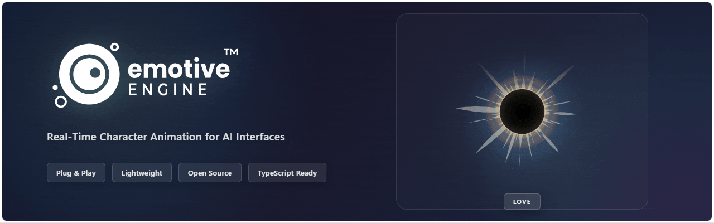
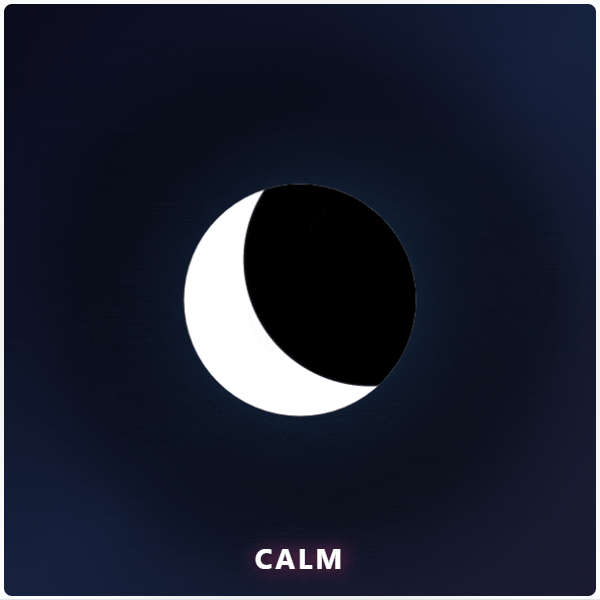

<div align="center">
  

[](https://www.npmjs.com/package/@joshtol/emotive-engine)
[](./LICENSE.md)
[](https://www.npmjs.com/package/@joshtol/emotive-engine)

**Real-time character animation for AI interfaces**

Particle-based emotional visualization • Shape morphing • Dynamic gestures •
Pure Canvas 2D • TypeScript ready

[Documentation](https://github.com/joshtol/emotive-engine/wiki) •
[Examples](examples/) •
[NPM](https://www.npmjs.com/package/@joshtol/emotive-engine)

</div>

## Quick Start

```bash
npm install @joshtol/emotive-engine
```

```javascript
import EmotiveMascot from '@joshtol/emotive-engine';

const mascot = new EmotiveMascot({
    canvasId: 'mascot-canvas',
});

await mascot.init();
mascot.start();

mascot.setEmotion('calm');
mascot.morphTo('moon');
mascot.express('breathe');
```

<div align="center">
  
</div>

## Features

- **Rich Emotions** - Joy, calm, anger, fear, surprise, sadness, love, and more
- **Shape Morphing** - Hearts, stars, moons, circles with smooth transitions
- **Dynamic Gestures** - Bounce, spin, pulse, breathe, wave, and more
- **Audio Reactive** - Beat detection and frequency visualization
- **TypeScript** - Full type definitions included
- **High Performance** - Smooth on mobile with adaptive quality

See [full documentation](https://github.com/joshtol/emotive-engine/wiki) for API
reference, advanced features, and examples.

## Contributing

Contributions welcome! See [CONTRIBUTING.md](./CONTRIBUTING.md)

## License

MIT License - see [LICENSE.md](./LICENSE.md)

---

<div align="center">

**Meta: Made with Emotive Engine**

The assets in this README were created using the engine itself:

- [Hero Banner Generator](examples/hero-banner-capture.html) (HTML + live code)
- [Demo GIF Generator](examples/emotion-demo-capture.html) (HTML + live code)

Created by [Joshua Tollette](https://github.com/joshtol)

</div>
