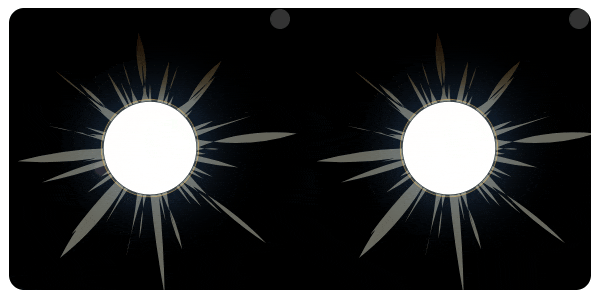

<div align="center">
  

[](https://www.npmjs.com/package/@joshtol/emotive-engine)
[](./LICENSE.md)
[](https://www.npmjs.com/package/@joshtol/emotive-engine)

**Real-time character animation for AI interfaces**

Particle-based emotional visualization • Shape morphing • Dynamic gestures •
Pure Canvas 2D • TypeScript ready

[🎮 Live Demo](https://emotiveengine.com/demo) •
[Documentation](https://github.com/joshtol/emotive-engine/wiki) •
[Examples](examples/) •
[NPM](https://www.npmjs.com/package/@joshtol/emotive-engine)

</div>

## Quick Start

```bash
npm install @joshtol/emotive-engine
```

```javascript
import EmotiveMascot from '@joshtol/emotive-engine';

// Get canvas element
const canvas = document.getElementById('mascot-canvas');

// Create mascot instance
const mascot = new EmotiveMascot({
    canvasId: 'mascot-canvas',
    targetFPS: 60,
    defaultEmotion: 'neutral',
});

// CRITICAL: Initialize with canvas element
await mascot.init(canvas);
mascot.start();

// Try these commands
mascot.setEmotion('calm');
mascot.morphTo('moon');
mascot.express('breathe');
```

## Features

- **Rich Emotions** - Joy, calm, excited, sadness, love, focused, anger, fear,
  surprise, and more
- **Shape Morphing** - Circle, heart, star, sun, moon with smooth transitions
- **Dynamic Gestures** - Bounce, spin, pulse, glow, breathe, expand
- **Audio Reactive** - Beat detection and frequency visualization
- **Semantic Performances** - Context-aware emotional choreography (44 built-in)
- **TypeScript** - Full type definitions included
- **High Performance** - Smooth on mobile with adaptive quality

## Real-World Applications

Emotive Engine powers emotional AI interfaces across multiple industries:

| Industry          | Use Case                   | Live Demo                                                   | Value Proposition                                                       |
| ----------------- | -------------------------- | ----------------------------------------------------------- | ----------------------------------------------------------------------- |
| 🛒 **Retail**     | AI Shopping Assistant      | [View Demo](https://emotiveengine.com/use-cases/retail)     | Reduce cart abandonment with empathetic, celebratory interactions       |
| 📚 **Education**  | Cherokee Language Learning | [View Demo](https://emotiveengine.com/use-cases/cherokee)   | Cultural preservation through engaging, emotionally-responsive tutoring |
| 🏥 **Healthcare** | Patient Check-in Interface | _Coming Soon_                                               | Improve satisfaction scores with calming, empathetic avatars            |
| 🏠 **Smart Home** | Voice Assistant Avatar     | [View Demo](https://emotiveengine.com/use-cases/smart-home) | Visual feedback for voice commands with personality                     |
| 🎮 **Gaming**     | Music-Synced NPCs          | [Examples](examples/)                                       | Characters that react to soundtrack with emotional expressions          |

**Proven in Production:** Live demos at
[emotiveengine.com](https://emotiveengine.com) with 60 FPS performance on mobile
devices.

See [full documentation](https://github.com/joshtol/emotive-engine/wiki) for API
reference, advanced features, and examples.

## How It Works: Musical Time vs Clock Time

Most animation libraries work in milliseconds. Music works in beats. Emotive
Engine bridges the gap:

<div align="center">
  
</div>

**The Problem:** Hardcode an animation to bounce for 500ms. Perfect at 120 BPM.
Switch to a 90 BPM song? Everything drifts off-rhythm because 500ms is now 0.75
beats.

**The Solution:** Emotive Engine uses **musical time** as the atomic unit.
Specify animations in beats, not milliseconds:

```javascript
// Traditional approach (breaks when tempo changes)
setTimeout(() => bounce(), 500);

// Emotive Engine approach (adapts to any tempo)
mascot.express('bounce'); // Automatically becomes 667ms at 90 BPM
```

A "bounce" specified as "1 beat" automatically becomes:

- 500ms at 120 BPM
- 667ms at 90 BPM
- 353ms at 170 BPM

Change the tempo, everything adjusts. No recalculation needed.

**For Business/Acquisition Inquiries:**

- 📊 [Business Potential & Revenue Models](docs/BUSINESS_POTENTIAL.md)
- 🔬 [Technical Innovations & Patent-Eligible Systems](docs/INNOVATIONS.md)

## Examples Gallery

Explore interactive examples showing different capabilities:

| Example                                                      | Description                                                   | Demo                                                |
| ------------------------------------------------------------ | ------------------------------------------------------------- | --------------------------------------------------- |
| **[Interactive Playground](https://emotiveengine.com/demo)** | Full-featured demo with gestures, emotions, music, and combos | [**Try it live →**](https://emotiveengine.com/demo) |
| **[Rhythm Sync](examples/rhythm-sync-demo.html)**            | Upload music and watch the mascot dance with beat detection   | [View code](examples/rhythm-sync-demo.html)         |
| **[Basic Usage](examples/basic-usage.html)**                 | Minimal setup showing core emotion and gesture APIs           | [View code](examples/basic-usage.html)              |
| **[Breathing App](examples/breathing-app.html)**             | Guided breathing exercise with calm animations                | [View code](examples/breathing-app.html)            |
| **[Custom Gestures](examples/custom-gesture.html)**          | Create your own gesture animations                            | [View code](examples/custom-gesture.html)           |
| **[LLM Integration](examples/llm-integration/)**             | Connect to Claude AI for dynamic emotional responses          | [View code](examples/llm-integration/)              |

All examples are vanilla HTML/JS - no build tools required!

## Performance & Compatibility

### Browser Support

- **Chrome/Edge**: 90+ ✅
- **Firefox**: 88+ ✅
- **Safari**: 14+ ✅
- **Mobile**: iOS Safari 14+, Chrome Android 90+ ✅

### Performance Guidelines

- **Recommended particle count**: 200-500 particles for 60fps on desktop
- **Mobile**: Automatically reduces to 100-200 particles
- **Canvas size**: Optimized for 300x300 to 800x800px
- **Adaptive quality**: Automatically scales based on device capabilities

### What's included

- Pure Canvas 2D rendering (no WebGL dependency)
- Zero framework dependencies
- Fully tree-shakeable ES modules
- TypeScript definitions included
- Source maps for debugging

## Documentation

- [API Reference](https://github.com/joshtol/emotive-engine/wiki) - Complete API
  docs
- [Examples](examples/) - Interactive code examples
- [Technical Innovations](docs/INNOVATIONS.md) - Patent-eligible systems
- [Business Potential](docs/BUSINESS_POTENTIAL.md) - Market analysis & revenue
  models
- [Changelog](CHANGELOG.md) - Version history with innovation timestamps

## Contributing

We welcome contributions from the community! 🎉

- **[Contributing Guide](./CONTRIBUTING.md)** - Development setup, coding
  standards, and workflow
- **[Code of Conduct](./CODE_OF_CONDUCT.md)** - Our community standards
- **[Contributors](./CONTRIBUTORS.md)** - Hall of fame for our contributors

### Quick Start for Contributors

1. Fork and clone the repository
2. Install dependencies: `npm install`
3. Run development build: `npm run build:dev`
4. Run tests: `npm test`
5. See [CONTRIBUTING.md](./CONTRIBUTING.md) for detailed guidelines

Found a bug? Have a feature request? Open an issue on GitHub!

## Community

- **[GitHub Discussions](https://github.com/joshtol/emotive-engine/discussions)** -
  Ask questions, share ideas
- **[Issue Tracker](https://github.com/joshtol/emotive-engine/issues)** - Report
  bugs, request features
- **[Twitter](https://twitter.com/search?q=%23EmotiveEngine)** - Follow
  `#EmotiveEngine` for updates

## License

MIT License - see [LICENSE.md](./LICENSE.md)

---

<div align="center">

**Meta: Made with Emotive Engine**

The assets in this README were created using the engine itself:

- [Hero Banner Generator](examples/hero-banner-capture.html) (HTML + live code)
- [Demo GIF Generator](examples/emotion-demo-capture.html) (HTML + live code)

Created by [Joshua Tollette](https://github.com/joshtol)

</div>
