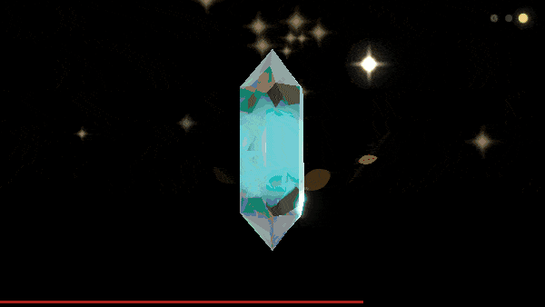
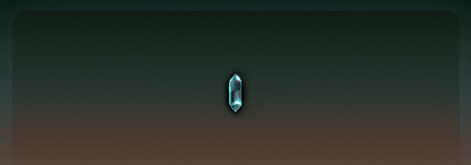
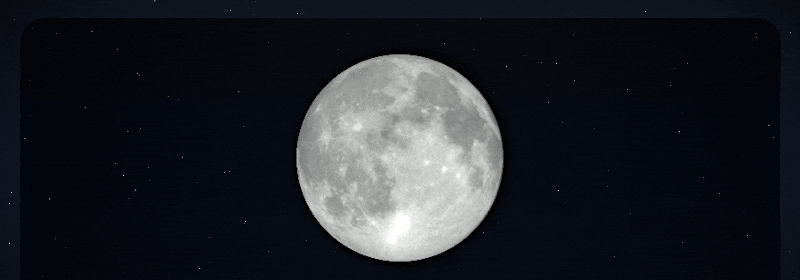
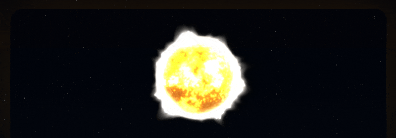
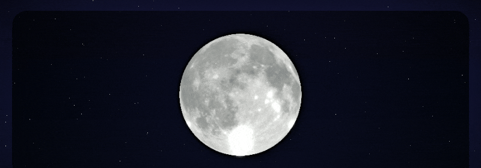
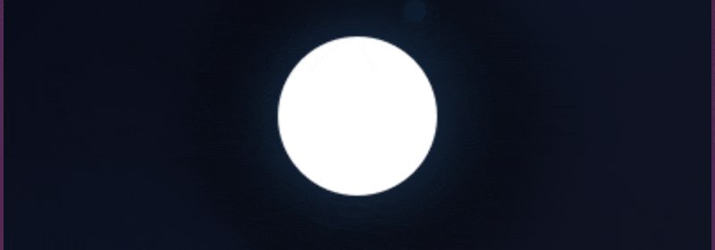
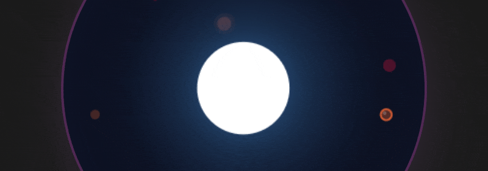
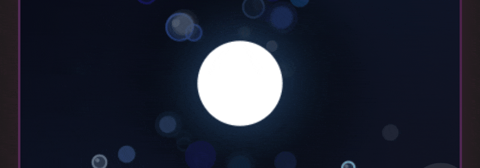
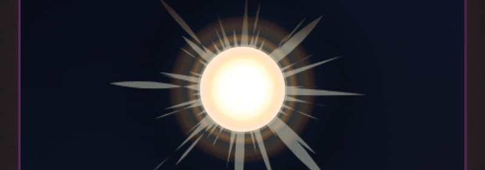

<div align="center">

# Emotive Engine

**Expressive AI mascots for modern interfaces**

[](https://www.npmjs.com/package/@joshtol/emotive-engine)
[](./LICENSE.md)
[](https://www.npmjs.com/package/@joshtol/emotive-engine)



Real-time character animation engine with **Canvas 2D** and **WebGL 3D**
rendering.<br/> 8 elemental shader systems. 160+ elemental gestures. One
replicable pattern.

**[Live Demo](https://joshtol.github.io/emotive-engine)** ·
**[Elemental Gestures Demo](https://joshtol.github.io/emotive-engine/examples/3d/elemental-gestures.html)**
· **[NPM](https://www.npmjs.com/package/@joshtol/emotive-engine)**

</div>

---

## Quick Start

```bash
npm install @joshtol/emotive-engine
```

### 3D Mode (WebGL)

```javascript
import { EmotiveMascot3D } from '@joshtol/emotive-engine/3d';

const mascot = new EmotiveMascot3D({
    coreGeometry: 'crystal',
    assetBasePath: '/assets', // self-hosted assets (see below)
});

mascot.init(document.getElementById('container'));
mascot.start();

mascot.setEmotion('joy');
mascot.express('bounce');
mascot.morphTo('heart');
mascot.feel('happy, bouncing'); // Natural language control
```

3D mode requires Three.js: `npm install three`

### 2D Mode (Canvas)

```javascript
import { EmotiveMascot } from '@joshtol/emotive-engine';

const mascot = new EmotiveMascot();
await mascot.init(document.getElementById('container'));
mascot.start();
mascot.feel('happy, bouncing');
```

2D mode has no dependencies and requires no external assets.

---

## Features

<table>
<tr>
<td width="50%">

### 3D WebGL Rendering

- Custom GLSL shaders with subsurface scattering
- Physically-based materials and bloom effects
- 8 moon phases with tidal lock camera
- Solar and lunar eclipse simulations
- Runtime geometry morphing

</td>
<td width="50%">

### 2D Canvas Rendering

- Lightweight pure Canvas 2D
- Dynamic particle effects
- Shape morphing animations
- Gaze tracking
- Mobile-optimized

</td>
</tr>
</table>

**Shared:** 15 emotions · 180+ gestures · Natural language `feel()` API ·
TypeScript definitions · Unified API

---

## Demo Gallery

### 3D WebGL

<table>
<tr>
<td align="center" width="33%">
<br/>
<strong>Crystal Soul</strong><br/>
<sub>Subsurface scattering shader</sub>
</td>
<td align="center" width="33%">
<br/>
<strong>Moon Phases</strong><br/>
<sub>8 phases with tidal lock</sub>
</td>
<td align="center" width="33%">
<br/>
<strong>Solar Eclipse</strong><br/>
<sub>Corona and diamond ring</sub>
</td>
</tr>
<tr>
<td align="center" colspan="3">
<br/>
<strong>Blood Moon Eclipse</strong><br/>
<sub>Rayleigh scattering simulation</sub>
</td>
</tr>
</table>

### 2D Canvas

<table>
<tr>
<td align="center" width="33%">
<br/>
<strong>Hello World</strong>
</td>
<td align="center" width="33%">
<br/>
<strong>Basic Usage</strong>
</td>
<td align="center" width="33%">
<br/>
<strong>Breathing App</strong>
</td>
</tr>
<tr>
<td align="center" width="33%">
<br/>
<strong>Event Handling</strong>
</td>
<td align="center" width="33%">
<br/>
<strong>Rhythm Sync</strong>
</td>
<td align="center" width="33%">
<br/>
<strong>LLM Integration</strong>
</td>
</tr>
</table>

---

## 3D Assets

The npm package ships **JavaScript only**. GLB models, textures, and HDRI maps
must be self-hosted (~24 MB). They live in `assets/` in this repository.

```javascript
new EmotiveMascot3D({
    assetBasePath: '/assets', // wherever you host the assets folder
});
```

| Hosting Option        | `assetBasePath`                                     |
| --------------------- | --------------------------------------------------- |
| **Copy to `public/`** | `'/assets'`                                         |
| **CDN / S3**          | `'https://cdn.example.com/emotive-engine/assets'`   |
| **GitHub Pages**      | `'https://joshtol.github.io/emotive-engine/assets'` |

```
<assetBasePath>/
├── models/Elements/   # GLB models for elemental effects
├── textures/          # Crystal, Moon, Sun textures
└── hdri/              # Environment maps (optional)
```

---

## CDN Usage

```html
<!-- 2D (UMD, no dependencies) -->
<script src="https://unpkg.com/@joshtol/emotive-engine/dist/emotive-mascot.umd.js"></script>

<!-- 3D (ESM, requires Three.js import map) -->
<script type="importmap">
    {
        "imports": {
            "three": "https://unpkg.com/three@0.170.0/build/three.module.min.js"
        }
    }
</script>
<script type="module">
    import { EmotiveMascot3D } from 'https://unpkg.com/@joshtol/emotive-engine/dist/emotive-mascot-3d.js';
</script>
```

---

## Documentation

| Doc                                              | Description                                                        |
| ------------------------------------------------ | ------------------------------------------------------------------ |
| **[API Reference](./docs/API.md)**               | All methods, configuration options, emotions, gestures, geometries |
| **[LLM Integration](./docs/LLM_INTEGRATION.md)** | Natural language `feel()` API, system prompt examples              |
| **[Gestures](./docs/GESTURES.md)**               | Full gesture catalog (180+ base + 160+ elemental)                  |
| **[Quick Reference](./docs/QUICK_REFERENCE.md)** | Cheat sheet for emotions, undertones, and common patterns          |
| **[Architecture](./docs/ARCHITECTURE.md)**       | Internal design and rendering pipeline                             |

---

## Running Locally

```bash
git clone https://github.com/joshtol/emotive-engine.git
cd emotive-engine
npm install && npm run build && npm run local
# → http://localhost:3001
```

---

## License

MIT — see [LICENSE.md](./LICENSE.md)

<div align="center">

Created by [Joshua Tollette](https://github.com/joshtol)

</div>
