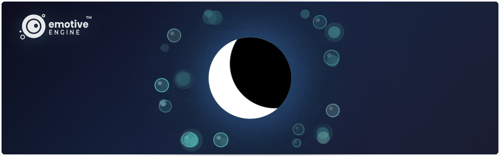

<div align="center">
  

[](https://www.npmjs.com/package/@joshtol/emotive-engine)
[](./LICENSE.md)
[](https://www.npmjs.com/package/@joshtol/emotive-engine)

**Real-time character animation for AI interfaces**

Particle-based emotional visualization • Shape morphing • Dynamic gestures •
Pure Canvas 2D • TypeScript ready

[🎮 Live Demo](https://joshtol.github.io/emotive-engine/demo/) •
[Documentation](https://github.com/joshtol/emotive-engine/wiki) •
[Examples](examples/) •
[NPM](https://www.npmjs.com/package/@joshtol/emotive-engine)

</div>

## Quick Start

```bash
npm install @joshtol/emotive-engine
```

```javascript
import EmotiveMascot from '@joshtol/emotive-engine';

const mascot = new EmotiveMascot({
    canvasId: 'mascot-canvas',
});

await mascot.init();
mascot.start();

mascot.setEmotion('calm');
mascot.morphTo('moon');
mascot.express('breathe');
```

<div align="center">
  
</div>

## Features

- **Rich Emotions** - Joy, calm, anger, fear, surprise, sadness, love, and more
- **Shape Morphing** - Hearts, stars, moons, circles with smooth transitions
- **Dynamic Gestures** - Bounce, spin, pulse, breathe, wave, and more
- **Audio Reactive** - Beat detection and frequency visualization
- **TypeScript** - Full type definitions included
- **High Performance** - Smooth on mobile with adaptive quality

See [full documentation](https://github.com/joshtol/emotive-engine/wiki) for API
reference, advanced features, and examples.

## Examples Gallery

Explore interactive examples showing different capabilities:

| Example                                             | Description                                                 | Demo                                                       |
| --------------------------------------------------- | ----------------------------------------------------------- | ---------------------------------------------------------- |
| **[Rhythm Sync](examples/rhythm-sync-demo.html)**   | Upload music and watch the mascot dance with beat detection | [Try it →](https://joshtol.github.io/emotive-engine/demo/) |
| **[Basic Usage](examples/basic-usage.html)**        | Minimal setup showing core emotion and gesture APIs         | [View](examples/basic-usage.html)                          |
| **[Breathing App](examples/breathing-app.html)**    | Guided breathing exercise with calm animations              | [View](examples/breathing-app.html)                        |
| **[Custom Gestures](examples/custom-gesture.html)** | Create your own gesture animations                          | [View](examples/custom-gesture.html)                       |
| **[Event Handling](examples/event-handling.html)**  | Listen to engine events and react to state changes          | [View](examples/event-handling.html)                       |
| **[LLM Integration](examples/llm-integration/)**    | Connect to Claude AI for dynamic emotional responses        | [View](examples/llm-integration/)                          |

All examples are vanilla HTML/JS - no build tools required!

## Performance & Compatibility

### Browser Support

- **Chrome/Edge**: 90+ ✅
- **Firefox**: 88+ ✅
- **Safari**: 14+ ✅
- **Mobile**: iOS Safari 14+, Chrome Android 90+ ✅

### Performance Guidelines

- **Recommended particle count**: 200-500 particles for 60fps on desktop
- **Mobile**: Automatically reduces to 100-200 particles
- **Canvas size**: Optimized for 300x300 to 800x800px
- **Adaptive quality**: Automatically scales based on device capabilities

### What's included

- Pure Canvas 2D rendering (no WebGL dependency)
- Zero framework dependencies
- Fully tree-shakeable ES modules
- TypeScript definitions included
- Source maps for debugging

## Contributing

Contributions welcome! See [CONTRIBUTING.md](./CONTRIBUTING.md)

## License

MIT License - see [LICENSE.md](./LICENSE.md)

---

<div align="center">

**Meta: Made with Emotive Engine**

The assets in this README were created using the engine itself:

- [Hero Banner Generator](examples/hero-banner-capture.html) (HTML + live code)
- [Demo GIF Generator](examples/emotion-demo-capture.html) (HTML + live code)

Created by [Joshua Tollette](https://github.com/joshtol)

</div>
