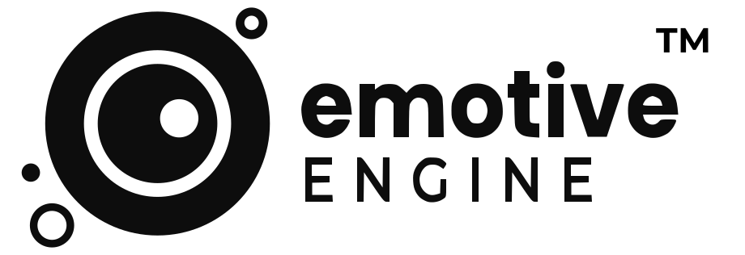

<div align="center">
  
  
  [](https://www.npmjs.com/package/emotive-engine)
  [-yellow.svg)](./LICENSE.md)
  [](https://github.com/joshtol/emotive-engine)
  [](https://github.com/joshtol/emotive-engine)

  **A high-performance, emotionally-aware particle mascot system for next-generation conversational UIs**
  
  *"Making invisible states visible through coordinated particle chaos"*
  
  Built with pure Canvas 2D API, achieving rock-solid 60fps animations with thousands of particles - no WebGL, no heavy frameworks required.
</div>

## 🌟 Features

### Production-Ready Engine
- **13+ Emotional States**: From joy to contemplation, each with unique particle behaviors
- **15 Particle Behaviors**: Modular, extensible behaviors with visual documentation
- **26 Gesture Animations**: Modular gesture system with blending, override, and effect modes
- **Performance Optimized**: Rock-solid 60fps with 1000+ particles
- **Adaptive Degradation**: Automatically adjusts quality for consistent performance
- **Web Worker Support**: Offload heavy computations for smooth main thread

### Technical Excellence
- **Modular Architecture**: Clean separation of concerns with registry pattern
- **Plugin System**: Full extensibility for emotions, gestures, and behaviors via adapters
- **3D Particle Depth**: Z-coordinate system with foreground/background layers
- **Zero Heavy Dependencies**: Pure JavaScript, no Three.js or WebGL required
- **Dynamic Visual Resampling**: Maintains quality on resize without re-initialization
- **Particle Pooling**: Efficient memory management with object recycling
- **Value-Agnostic Design**: All configurations externalized for easy tuning
- **Mobile Optimized**: Touch support with adaptive performance scaling
- **Accessibility Built-in**: Screen reader support and keyboard navigation

## 🚀 Quick Start

```bash
npm install emotive-engine
```

```javascript
import EmotiveMascot from './src/EmotiveMascot.js';

// Create an emotive mascot
const mascot = new EmotiveMascot({
  canvasId: 'mascot-canvas',
  emotion: 'neutral',
  renderingStyle: 'classic'  // or 'scifi' for alternative renderer
});

// Start the animation
mascot.start();

// Set emotions and trigger gestures
mascot.setEmotion('joy');
mascot.express('bounce');  // Direct gesture execution

// Set emotions with undertones for depth
mascot.setEmotion('anger', { undertone: 'intense' });  // Electric, overwhelming
mascot.setEmotion('love', { undertone: 'subdued' });   // Ghostly, subtle

// Chain gestures for complex expressions
mascot.express(['bounce', 'spin', 'pulse']);

// Respond to events
mascot.on('stateChange', (state) => {
  console.log(`Mascot is feeling ${state.emotion} (${state.undertone || 'clear'})`);
});
```

## 🎨 Live Demo

- [**Themed Sci-Fi Interface**](https://joshtol.github.io/emotive-engine/themed-scifi-demo.html) - Futuristic UI with light/dark/night themes showcasing the full emotional range

## 🏗️ Architecture

### Modular Systems (v4.0.0)

The entire engine has been fully modularized with plugin support. Each system uses a registry pattern with plugin adapters for complete extensibility:

```
src/core/
├── Particle.js           # Particle orchestrator
├── emotions/            # Modular emotion system
│   ├── index.js         # Emotion registry with plugin support
│   ├── plugin-adapter.js # Plugin emotion integration
│   └── states/          # 13 emotional states
│       ├── neutral.js   # Calm baseline
│       ├── joy.js       # Playful happiness
│       ├── sadness.js   # Melancholic sorrow
│       ├── anger.js     # Intense rage
│       ├── fear.js      # Anxious fleeing
│       ├── surprise.js  # Sudden shock
│       ├── disgust.js   # Revulsion
│       ├── love.js      # Warm affection
│       ├── suspicion.js # Watchful alertness
│       ├── excited.js   # High energy
│       ├── resting.js   # Deep relaxation
│       ├── euphoria.js  # Radiant hope
│       └── focused.js   # Intense concentration
├── gestures/            # Modular gesture system
│   ├── index.js         # Gesture registry with plugin support
│   ├── plugin-adapter.js # Plugin gesture integration
│   ├── motions/         # Blending gestures (6)
│   │   ├── bounce.js    # Vertical oscillation
│   │   ├── pulse.js     # Radial expansion
│   │   ├── shake.js     # Random jitter
│   │   ├── nod.js       # Up-down motion
│   │   ├── vibrate.js   # High-frequency shake
│   │   └── orbit.js     # Circular motion
│   ├── transforms/      # Override gestures (7)
│   │   ├── spin.js      # Rotation around center
│   │   ├── jump.js      # Squash and leap
│   │   ├── morph.js     # Shape formations
│   │   ├── stretch.js   # Axis scaling
│   │   ├── tilt.js      # Gather and sway
│   │   ├── orbital.js   # Planetary motion
│   │   └── hula.js      # Hula-hoop motion
│   └── effects/         # Visual effects (13)
│       ├── wave.js      # Infinity pattern
│       ├── drift.js     # Controlled float
│       ├── flicker.js   # Opacity variation
│       ├── burst.js     # Explosive spread
│       ├── directional.js # Linear motion
│       ├── settle.js    # Gentle landing
│       ├── fade.js      # Transparency effect
│       ├── hold.js      # Freeze position
│       ├── breathe.js   # Expansion/contraction
│       ├── expand.js    # Growing outward
│       ├── contract.js  # Shrinking inward
│       ├── flash.js     # Brightness burst
│       └── glow.js      # Radiant light
└── particles/
    ├── behaviors/        # 15 particle behaviors
    │   ├── index.js      # Behavior registry
    │   ├── ambient.js    # Gentle drift (neutral)
    │   ├── rising.js     # Upward float (joy)
    │   ├── falling.js    # Downward sink (sadness)
    │   ├── aggressive.js # Chaotic bursts (anger)
    │   ├── scattering.js # Flee from center (fear)
    │   ├── burst.js      # Explosive expansion (surprise)
    │   ├── repelling.js  # Push away (disgust)
    │   ├── orbiting.js   # Valentine dance (love)
    │   ├── connecting.js # Social energy (curiosity)
    │   ├── resting.js    # Ultra-slow (sleepy)
    │   ├── radiant.js    # Sunburst (euphoria)
    │   ├── popcorn.js    # Bouncing (celebration)
    │   ├── ascending.js  # Incense smoke (zen)
    │   ├── erratic.js    # Nervous jitter (anxiety)
    │   ├── cautious.js   # Watchful pause (suspicion)
    │   └── plugin-adapter.js # Plugin integration
    ├── config/           # Physics and settings
    └── utils/            # Color, math, easing
```

## 🔌 Plugin System (v4.0.0)

The Emotive Engine features a powerful plugin system that allows you to extend functionality without modifying core files. Perfect for npm package users who want to add custom features.

### Creating a Plugin

Plugins can add custom emotions, gestures, behaviors, and even modify rendering:

```javascript
class MyCustomPlugin {
    constructor() {
        this.type = 'composite'; // emotion, gesture, behavior, or composite
        this.name = 'MyCustomPlugin';
        this.version = '1.0.0';
    }
    
    init(mascot) {
        // Called when plugin is registered
        // Access emotion/gesture adapters via mascot.Emotions or mascot.Gestures
    }
    
    update(deltaTime, state) {
        // Called every frame
    }
    
    render(ctx, state) {
        // Optional custom rendering
    }
    
    destroy() {
        // Cleanup when unregistered
    }
}

// Use the plugin
import EmotiveMascot from 'emotive-engine';
const mascot = new EmotiveMascot(canvas);
mascot.registerPlugin(new MyCustomPlugin());
```

### Plugin Adapters

The engine provides adapters for registering custom content:

```javascript
// In your plugin's init() method:
init(mascot) {
    // Register a custom emotion
    const emotionAdapter = mascot.Emotions.pluginAdapter;
    emotionAdapter.registerPluginEmotion('zen', {
        name: 'zen',
        color: '#9B7EDE',
        visual: { /* ... */ },
        modifiers: { /* ... */ }
    });
    
    // Register a custom gesture
    const gestureAdapter = mascot.Gestures.pluginAdapter;
    gestureAdapter.registerPluginGesture('meditate', {
        name: 'meditate',
        type: 'blending',
        apply: (particle, progress) => { /* ... */ }
    });
}
```

### Example Plugins

See `src/plugins/` for complete examples:
- `example-emotion-plugin.js` - Adds "nostalgic" and "determined" emotions
- `example-gesture-plugin.js` - Adds "wobble", "figure8", and "heartbeat" gestures
- `example-particle-plugin.js` - Custom particle behaviors

### Adding New Behaviors, Gestures & Emotions

#### Creating a New Particle Behavior

1. Copy `particles/behaviors/_template.js`
2. Implement `initialize()` and `update()` functions
3. Add visual documentation and recipes
4. Import in `behaviors/index.js`
5. That's it! The registry handles the rest

#### Creating a New Gesture

1. Choose the appropriate category:
   - `gestures/motions/` for blending gestures
   - `gestures/transforms/` for override gestures
   - `gestures/effects/` for visual effects
2. Create your gesture file with this structure:
   ```javascript
   export default {
     name: 'myGesture',
     emoji: '🎭',
     type: 'blending', // or 'override'
     description: 'What it does',
     apply: function(particle, progress, motion, dt, centerX, centerY) {
       // Your gesture logic here
     },
     cleanup: function(particle) {
       // Optional cleanup
     }
   };
   ```
3. Import in `gestures/index.js`
4. The gesture is now available everywhere!

#### Creating a New Emotion

1. Create a new file in `emotions/states/`
2. Define the emotion with all its properties:
   ```javascript
   export default {
     name: 'myEmotion',
     emoji: '😊',
     description: 'What this emotion represents',
     
     // Visual properties
     visual: {
       glowColor: '#FFD700',
       glowIntensity: 1.2,
       particleRate: 15,
       particleBehavior: 'ambient',
       breathRate: 1.0,
       particleColors: [
         { color: '#FFD700', weight: 30 },
         // ... depth palette
       ]
     },
     
     // Gesture modifiers
     modifiers: {
       speed: 1.0,
       amplitude: 1.0,
       intensity: 1.0,
       smoothness: 1.0,
       regularity: 1.0
     },
     
     // Typical gestures for this emotion
     typicalGestures: ['bounce', 'spin', 'pulse'],
     
     // Transition configuration
     transitions: {
       duration: 500,
       easing: 'easeInOut',
       priority: 5
     }
   };
   ```
3. Import in `emotions/index.js`
4. The emotion is now fully integrated!

## 🧠 Emotional Intelligence

### Modular Emotion System (v3.1.0)

Each emotion is now a self-contained module combining:
- **Visual Properties**: Colors, glow, particle spawn rates
- **Gesture Modifiers**: How this emotion affects animations
- **Typical Gestures**: Common animations for this emotion
- **Transition Hints**: Smooth state changes
- **Special Effects**: Unique features per emotion

### Core Emotions & Particle Behaviors

| Emotion | Behavior | Visual Characteristics |
|---------|----------|------------------------|
| **Neutral** | `ambient` | Gentle upward drift like smoke |
| **Joy** | `rising` + `popcorn` | Buoyant upward movement with celebration pops |
| **Sadness** | `falling` | Heavy particles sinking with weight |
| **Anger** | `aggressive` | Sharp, chaotic movement with violent bursts |
| **Fear** | `scattering` | Particles fleeing frantically from center |
| **Surprise** | `burst` | Explosive outward expansion |
| **Disgust** | `repelling` | Maintaining distance, pushing away |
| **Love** | `orbiting` | Valentine firefly dance around center |
| **Curiosity** | `connecting` | Chaotic but attracted to center |
| **Sleepy** | `resting` | Ultra-slow vertical drift |
| **Euphoria** | `radiant` | Sunbeam radiation outward |
| **Zen** | `ascending` | Slow rise like incense smoke |
| **Nervous** | `erratic` | Jittery, unpredictable movement |
| **Suspicion** | `cautious` | Slow movement with watchful pauses |

### Modular Gesture System (v4.0.0)

The gesture system has been completely modularized with 26 gesture animations organized by type, with full plugin support:

#### Motion Gestures (Blending)
These gestures blend with existing particle behavior:

| Gesture | Description | Use Case |
|---------|-------------|----------|
| `bounce` | Vertical oscillation | Joy, excitement |
| `pulse` | Radial expansion/contraction | Heartbeat, emphasis |
| `shake` | Random jitter | Nervousness, cold |
| `nod` | Up-down motion | Agreement, understanding |
| `vibrate` | High-frequency shake | Intensity, energy |
| `orbit` | Circular motion | Mystery, cycles |

#### Transform Gestures (Override)
These gestures completely control particle motion:

| Gesture | Description | Use Case |
|---------|-------------|----------|
| `spin` | Rotation around center | Confusion, dizzy |
| `jump` | Squash, leap, and land | Surprise, celebration |
| `morph` | Form geometric patterns | Transformation |
| `stretch` | Axis scaling | Yawn, reaching |
| `tilt` | Gather and sway | Curiosity, lean |
| `orbital` | Planetary motion | Mystery, cosmic |
| `hula` | Hula-hoop motion | Playful, circular |

#### Effect Gestures (Visual)
These gestures create visual effects:

| Gesture | Description | Use Case |
|---------|-------------|----------|
| `wave` | Infinity pattern flow | Greeting, flow |
| `drift` | Controlled float | Daydream, float |
| `flicker` | Opacity variation | Glitch, unstable |
| `burst` | Explosive spread | Excitement, pop |
| `directional` | Linear motion | Focus, point |
| `settle` | Gentle landing | Calm, rest |
| `fade` | Transparency effect | Disappear, ghost |
| `hold` | Freeze position | Pause, think |
| `breathe` | Expansion/contraction | Life, meditation |
| `expand` | Growing outward | Growth, bloom |
| `contract` | Shrinking inward | Focus, compress |
| `flash` | Brightness burst | Alert, attention |
| `glow` | Radiant light | Warmth, energy |

## 🎨 Visual System

### Color Depth Palette

Each emotion uses a sophisticated 5-layer depth palette creating 3D particle effects:

- **MIDTONE (30%)**: Base color occupying middle space
- **DESATURATED (20%)**: Background depth, misty and distant
- **OVERSATURATED (20%)**: Foreground pop, electric and vibrant
- **HIGHLIGHT (15%)**: Light-catching particles
- **SHADOW (15%)**: Grounding depth particles

### Undertone System

Modify emotional expression with undertones:

```javascript
// Intense undertone - faster, more dramatic
mascot.setEmotion('joy', { undertone: 'intense' });

// Subdued undertone - slower, gentler
mascot.setEmotion('anger', { undertone: 'subdued' });

// Confused undertone - erratic modifications
mascot.setEmotion('neutral', { undertone: 'confused' });
```

## 🛠️ Development

### Prerequisites
- Node.js 14+
- Modern browser with Canvas 2D support

### Installation
```bash
git clone https://github.com/yourusername/emotive-engine.git
cd emotive-engine
npm install
```

### Running Locally
```bash
npm start
# Visit http://localhost:8080
```

### Testing
```bash
npm test          # Run test suite
npm run test:perf # Performance benchmarks
```

### Building for Production
```bash
npm run build     # Minified production build
```

## 📚 API Documentation

### EmotiveMascot Class

```javascript
const mascot = new EmotiveMascot(config);
```

#### Config Options
- `canvasId` (string): Target canvas element ID
- `emotion` (string): Initial emotional state
- `renderingStyle` (string): 'classic' or 'scifi'
- `particleLimit` (number): Max particles (default: 500)
- `enableSound` (boolean): Enable audio (default: false)
- `theme` (string): 'light', 'dark', or 'night'

#### Methods
- `start()`: Begin animation loop
- `stop()`: Pause animation
- `setEmotion(emotion, options)`: Change emotional state
- `express(gesture)`: Trigger gesture animation
- `on(event, handler)`: Event listener
- `setTheme(theme)`: Change visual theme
- `destroy()`: Clean up resources

#### Events
- `stateChange`: Emotion or undertone changed
- `gestureComplete`: Gesture animation finished
- `performanceWarning`: FPS dropped below threshold

## 🎮 Performance

### Optimization Strategies

1. **Particle Pooling**: Reuses particle objects to prevent garbage collection
2. **Batch Rendering**: Groups similar draw operations
3. **Spatial Indexing**: Efficient collision detection for behaviors
4. **Frame Skipping**: Maintains 60fps by dropping frames intelligently
5. **LOD System**: Reduces particle complexity at distance
6. **Worker Offloading**: Heavy calculations in Web Workers

### 3D Particle Depth System (v3.2.0)

The particle system now features pseudo-3D depth rendering:

#### Z-Coordinate System
- **Z-axis range**: -1.0 (behind orb) to +1.0 (in front of orb)
- **Layer distribution**: ~92% background, ~8% foreground (1/13 ratio)
- **Depth scaling**: 20% size variation based on z-position
- **Anti-stacking**: Foreground particles spawn with offset to prevent visual clustering

#### Rendering Layers
```javascript
// Three-layer rendering order:
1. Background particles (z < 0) - Rendered first
2. Orb/Core - Rendered middle  
3. Foreground particles (z >= 0) - Rendered last

// Access split rendering:
particleSystem.renderBackground(ctx, color); // Behind orb
particleSystem.renderForeground(ctx, color); // In front
```

#### Future Orbital Support
The z-coordinate system is designed for future orbital gestures where particles can dynamically transition between layers, creating true 3D motion effects like hula-hoop or orbit animations.

### Performance Targets

The engine is optimized to maintain 60fps with the following particle counts:
- **100-500 particles**: Rock-solid 60fps on modern browsers
- **1000 particles**: Target 60fps with adaptive degradation
- **2000+ particles**: Graceful performance scaling

*Performance varies by hardware and browser. The adaptive system automatically adjusts quality to maintain smooth animations.*

## 🤝 Contributing

We welcome contributions! The modular architecture makes it easy to add new behaviors and features.

### Adding a New Behavior

1. Create a new file in `src/core/particles/behaviors/`
2. Use the template and follow the pattern
3. Add comprehensive documentation
4. Submit a pull request

### Code Style
- ES6+ modules
- JSDoc comments
- Visual diagrams in comments
- Performance-conscious implementations
- Modular registry pattern for extensibility

## 📜 Licensing

Emotive Engine is released under a **dual license**:

- 🎨 **Artists, hobbyists, students, and educators** → **Free forever**  
- 💼 **Commercial use (companies, startups, monetized projects)** → **Requires a paid license**

---

### ✅ Free for Non-Commercial Use
You can use Emotive Engine at no cost if:
- You're an independent artist, student, or hobbyist.
- Your projects are personal, experimental, educational, or cultural.
- Your work is not monetized, sponsored, or tied to a business.

Examples:
- Personal Twitch overlays, YouTube experiments (no ads), music visualizers.
- School projects or academic research.
- Interactive art installations not backed by a brand.

---

### 💰 Commercial Licensing
If you or your organization make money, or your use supports a business, you need a **Commercial License**.

**Current Pricing (2025):**

| Tier       | Requirements                     | Pricing            |
|------------|----------------------------------|--------------------|
| 🎨 Indie   | Revenue < $100k/year             | $99/year or $499 one-time |
| 🚀 Startup | Revenue < $1M/year OR ≤ 10 staff | $500/year or $2,500 one-time |
| 🏢 Enterprise | Revenue ≥ $1M/year OR > 10 staff | Custom – starts at $25,000/year |

📧 For commercial inquiries: **licensing@emotiveengine.dev**

---

### ⚠️ Quick Rules
- If you're an **Artist** (independent human creator, not under contract with a company) → free.  
- If your project directly supports a **company, brand, or monetized activity** → paid license required.  
- The name **"Emotive Engine™"** is a claimed trademark. You may reference it factually, but not use it in branding or promotions without permission.

---

### 📖 Legal Docs
- [LICENSE.md](./LICENSE.md) → Non-Commercial License terms  
- [COMMERCIAL-LICENSE.md](./COMMERCIAL-LICENSE.md) → Sample commercial agreement

## 🙏 Credits

Created by Joshua Tollette and the Emotive Engine team.

Special thanks to all contributors who helped make this engine production-ready.

---

<div align="center">
  <i>Making AI conversations feel alive, one particle at a time.</i>
  
  ⭐ Star us on GitHub if you find this useful!
</div>