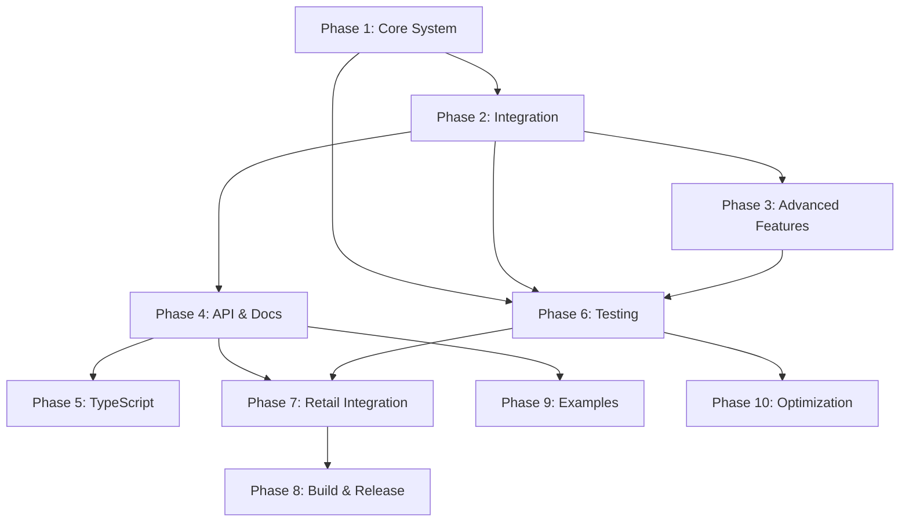

# Semantic Performance System - Implementation Plan

## Overview

This plan details the complete implementation of the Semantic Performance System
for the Emotive Mascot engine, enabling developers to use semantic actions
(`perform('celebrate')`) instead of manual choreography.

---

## Architecture Analysis

### Current Engine Structure

```
EmotiveMascot.js (Main API)
├── core/
│   ├── EmotiveStateMachine.js      (State management)
│   ├── AnimationController.js       (Animation control)
│   ├── GestureScheduler.js          (Gesture timing & queueing)
│   ├── EmotiveRenderer.js           (Rendering)
│   ├── ParticleSystem.js            (Particle effects)
│   ├── emotions/                    (Emotion definitions)
│   └── gestures/                    (Gesture definitions)
├── mascot/
│   ├── GestureController.js         (Gesture orchestration)
│   ├── StateCoordinator.js          (State coordination)
│   └── VisualizationRunner.js       (Visualization control)
└── utils/
    └── PositionController.js        (Position management)
```

### Extension Points Identified

1. **GestureScheduler.js** - Already handles gesture queueing, can be extended
   for sequences
2. **EmotiveStateMachine.js** - Manages state, can track conversation context
3. **GestureController.js** - Orchestrates gestures, ideal for performance logic
4. **EventManager** - Can emit performance events
5. **AnimationController** - Controls animations, can manage timed sequences

---

## Phase 1: Core Performance System Foundation

### 1.1 Create Performance System Module

**File:** `src/core/PerformanceSystem.js`

**Tasks:**

- [ ] Create PerformanceSystem class
- [ ] Implement performance definition registry
- [ ] Create context object structure (frustration, urgency, magnitude)
- [ ] Implement intensity calculator based on context
- [ ] Add performance event emitter
- [ ] Write unit tests for PerformanceSystem

**Dependencies:** None

**Estimated Time:** 4 hours

---

### 1.2 Create Performance Definitions Library

**File:** `src/core/performances/index.js`

**Tasks:**

- [ ] Create performances directory structure
- [ ] Define conversational performances (listening, thinking, acknowledging,
      guiding, empathizing, celebrating, reassuring)
- [ ] Define feedback performances (success_minor, success_major, success_epic,
      error_minor, error_major, error_critical)
- [ ] Define state performances (idle, waiting, processing, ready)
- [ ] Document each performance with emotion, gesture, timing
- [ ] Create performance schema/interface
- [ ] Write tests for performance definitions

**Dependencies:** 1.1

**Estimated Time:** 6 hours

**File Structure:**

```
src/core/performances/
├── index.js                  (Main export)
├── conversational.js         (Conversational performances)
├── feedback.js               (Feedback archetypes)
├── states.js                 (State performances)
└── schema.js                 (Performance schema definition)
```

---

### 1.3 Create Sequence Executor

**File:** `src/core/SequenceExecutor.js`

**Tasks:**

- [ ] Create SequenceExecutor class
- [ ] Implement timeline-based step execution
- [ ] Handle emotion, gesture, morph, chain actions
- [ ] Implement cancelation mechanism
- [ ] Add sequence completion callbacks
- [ ] Support looping sequences
- [ ] Write unit tests for SequenceExecutor

**Dependencies:** None (standalone)

**Estimated Time:** 5 hours

---

### 1.4 Create Context Manager

**File:** `src/core/ContextManager.js`

**Tasks:**

- [ ] Create ContextManager class
- [ ] Implement context state storage (frustration, urgency, magnitude)
- [ ] Create context update methods
- [ ] Implement context history tracking (optional, for analytics)
- [ ] Add context-based intensity calculation helper
- [ ] Write unit tests for ContextManager

**Dependencies:** None

**Estimated Time:** 3 hours

---

## Phase 2: Integration with Existing Engine

### 2.1 Integrate PerformanceSystem into EmotiveMascot

**File:** `src/EmotiveMascot.js`

**Tasks:**

- [ ] Import PerformanceSystem
- [ ] Initialize PerformanceSystem in constructor
- [ ] Create `perform(semantic, options)` method
- [ ] Wire up PerformanceSystem to GestureScheduler
- [ ] Wire up PerformanceSystem to EmotiveStateMachine
- [ ] Add context management hooks
- [ ] Update constructor to accept performance config
- [ ] Maintain backward compatibility with existing API

**Dependencies:** 1.1, 1.2, 1.3, 1.4

**Estimated Time:** 6 hours

---

### 2.2 Extend GestureScheduler for Sequences

**File:** `src/core/GestureScheduler.js`

**Tasks:**

- [ ] Add sequence scheduling support
- [ ] Implement timeline-based execution
- [ ] Support parallel and sequential steps
- [ ] Add sequence cancellation
- [ ] Maintain existing gesture queue compatibility
- [ ] Write tests for sequence scheduling

**Dependencies:** 1.3

**Estimated Time:** 4 hours

---

### 2.3 Enhance EmotiveStateMachine with Context

**File:** `src/core/EmotiveStateMachine.js`

**Tasks:**

- [ ] Add context storage to state machine
- [ ] Implement conversation state tracking (listening, thinking, responding)
- [ ] Create state transition hooks for automatic performances
- [ ] Add workflow state support (processing, success, error)
- [ ] Emit state change events with context
- [ ] Write tests for context integration

**Dependencies:** 1.4

**Estimated Time:** 5 hours

---

### 2.4 Create Looping System

**File:** `src/core/LoopingSystem.js`

**Tasks:**

- [ ] Create LoopingSystem class
- [ ] Implement repeating gesture logic
- [ ] Support configurable intervals
- [ ] Add auto-timeout support
- [ ] Implement loop start/stop methods
- [ ] Integrate with GestureScheduler
- [ ] Write tests for looping system

**Dependencies:** 2.2

**Estimated Time:** 3 hours

---

## Phase 3: Advanced Features

### 3.1 Implement Feedback Archetypes

**File:** `src/core/FeedbackSystem.js`

**Tasks:**

- [ ] Create FeedbackSystem class
- [ ] Implement `performFeedback(options)` method
- [ ] Map feedback types to performance sequences
- [ ] Support magnitude scaling (small, moderate, major, epic)
- [ ] Add reassurance flag support
- [ ] Integrate with PerformanceSystem
- [ ] Write tests for feedback system

**Dependencies:** 1.1, 1.2

**Estimated Time:** 4 hours

---

### 3.2 Create Custom Performance Builder

**File:** `src/core/PerformanceBuilder.js`

**Tasks:**

- [ ] Create PerformanceBuilder class
- [ ] Implement fluent API for building sequences
- [ ] Add step definition methods (emotion, gesture, morph, chain)
- [ ] Support timing and delays
- [ ] Allow saving custom performances
- [ ] Create example custom performances
- [ ] Write tests for builder

**Dependencies:** 1.3

**Estimated Time:** 4 hours

---

### 3.3 Implement Conversation State Automation

**File:** `src/core/ConversationStateManager.js`

**Tasks:**

- [ ] Create ConversationStateManager class
- [ ] Implement automatic state detection (listening → thinking → responding)
- [ ] Create state transition animations
- [ ] Support manual state overrides
- [ ] Add state callbacks
- [ ] Integrate with PerformanceSystem
- [ ] Write tests for conversation states

**Dependencies:** 2.3

**Estimated Time:** 5 hours

---

### 3.4 Add Performance Analytics

**File:** `src/core/PerformanceAnalytics.js`

**Tasks:**

- [ ] Create PerformanceAnalytics class
- [ ] Track performance usage patterns
- [ ] Record context when performances trigger
- [ ] Generate performance metrics
- [ ] Support export for analysis
- [ ] Add privacy controls
- [ ] Write tests for analytics

**Dependencies:** 1.1, 1.4

**Estimated Time:** 3 hours

---

## Phase 4: API & Documentation

### 4.1 Update Public API

**File:** `src/EmotiveMascotPublic.js`

**Tasks:**

- [ ] Export `perform()` method
- [ ] Export `performFeedback()` method
- [ ] Export `setContext()` method
- [ ] Export `setConversationState()` method
- [ ] Export `setWorkflowState()` method
- [ ] Export `performLoop()` method
- [ ] Export `performSequence()` method
- [ ] Export `definePerformance()` method
- [ ] Maintain backward compatibility
- [ ] Update type definitions

**Dependencies:** All Phase 1-3 tasks

**Estimated Time:** 4 hours

---

### 4.2 Update API Documentation

**File:** `API.md`

**Tasks:**

- [ ] Document `perform()` method with examples
- [ ] Document `performFeedback()` method
- [ ] Document `setContext()` method
- [ ] Document conversation state methods
- [ ] Document workflow state methods
- [ ] Document looping methods
- [ ] Document sequence builder API
- [ ] Add semantic performance catalog
- [ ] Add migration guide from manual to semantic
- [ ] Add best practices section

**Dependencies:** 4.1

**Estimated Time:** 6 hours

---

### 4.3 Create Performance Catalog

**File:** `docs/PERFORMANCE_CATALOG.md`

**Tasks:**

- [ ] Document all built-in performances
- [ ] Include emotion, gesture, timing for each
- [ ] Add visual diagrams of sequences
- [ ] Document context effects
- [ ] Add usage examples for each performance
- [ ] Create quick reference table
- [ ] Add cross-cultural notes

**Dependencies:** 1.2

**Estimated Time:** 5 hours

---

### 4.4 Create Migration Guide

**File:** `docs/SEMANTIC_MIGRATION_GUIDE.md`

**Tasks:**

- [ ] Document how to migrate from manual choreography
- [ ] Provide before/after examples
- [ ] Explain benefits of semantic API
- [ ] List breaking changes (none expected)
- [ ] Add troubleshooting section
- [ ] Include performance comparison
- [ ] Add FAQ section

**Dependencies:** 4.1, 4.2

**Estimated Time:** 4 hours

---

## Phase 5: TypeScript Support

### 5.1 Create TypeScript Definitions

**File:** `types/performances.d.ts`

**Tasks:**

- [ ] Define `PerformanceOptions` interface
- [ ] Define `ContextOptions` interface
- [ ] Define `FeedbackOptions` interface
- [ ] Define `PerformanceStep` interface
- [ ] Define semantic performance type literals
- [ ] Define conversation state types
- [ ] Define workflow state types
- [ ] Export all performance-related types

**Dependencies:** 4.1

**Estimated Time:** 3 hours

---

### 5.2 Update Main Type Definitions

**File:** `types/index.d.ts`

**Tasks:**

- [ ] Add `perform()` method signature
- [ ] Add `performFeedback()` method signature
- [ ] Add `setContext()` method signature
- [ ] Add `setConversationState()` method signature
- [ ] Add `setWorkflowState()` method signature
- [ ] Add `performLoop()` method signature
- [ ] Add `performSequence()` method signature
- [ ] Add `definePerformance()` method signature
- [ ] Import performance types

**Dependencies:** 5.1

**Estimated Time:** 2 hours

---

## Phase 6: Testing

### 6.1 Unit Tests

**Files:** `test/unit/performance/*.test.js`

**Tasks:**

- [ ] Test PerformanceSystem core functionality
- [ ] Test performance definition loading
- [ ] Test context-based intensity calculation
- [ ] Test sequence execution
- [ ] Test looping system
- [ ] Test feedback archetypes
- [ ] Test conversation state management
- [ ] Achieve >90% code coverage

**Dependencies:** All Phase 1-3 tasks

**Estimated Time:** 8 hours

---

### 6.2 Integration Tests

**Files:** `test/integration/performance/*.test.js`

**Tasks:**

- [ ] Test perform() with actual engine instance
- [ ] Test sequence execution with real renderer
- [ ] Test context propagation through system
- [ ] Test state transitions with performances
- [ ] Test looping with gesture scheduler
- [ ] Test performance chaining
- [ ] Test error handling

**Dependencies:** 6.1, Phase 2 tasks

**Estimated Time:** 6 hours

---

### 6.3 Visual Regression Tests

**Files:** `test/visual/performance/*.test.js`

**Tasks:**

- [ ] Capture baseline screenshots for each performance
- [ ] Test performance visual output consistency
- [ ] Test sequence timing accuracy
- [ ] Test intensity variations
- [ ] Test context effects on visuals
- [ ] Generate visual test report

**Dependencies:** 6.2

**Estimated Time:** 4 hours

---

## Phase 7: Retail Use Case Integration

### 7.1 Refactor AICheckoutAssistant

**File:** `site/src/app/use-cases/retail/AICheckoutAssistant.tsx`

**Tasks:**

- [ ] Remove manual emotion mapping code (lines 208-216)
- [ ] Replace with `mascot.perform()` calls
- [ ] Remove manual intensity calculation (lines 220-222)
- [ ] Replace with context-based approach
- [ ] Remove manual sequence choreography (lines 230-244)
- [ ] Replace with semantic performances
- [ ] Update listening state (lines 263-266) to use `setConversationState()`
- [ ] Add context updates based on frustration level
- [ ] Test all conversation flows
- [ ] Verify visual consistency

**Dependencies:** All Phase 1-4 tasks

**Estimated Time:** 4 hours

**Code Changes:**

```typescript
// BEFORE (lines 220-222, 230-244)
const intensity = frustration > 60 ? 1.0 : 0.7;
mascot.setEmotion(mascotAction.emotion, intensity);
setTimeout(() => mascot.express(mascotAction.gesture), 200);
if (action === 'celebrate' && frustration < 20) {
    setTimeout(() => {
        mascot.morphTo('sun');
        mascot.chain('radiance');
    }, 800);
}

// AFTER (1 line)
mascot.perform(action, { context: { frustration: frustrationLevel } });
```

---

### 7.2 Refactor CheckoutSimulation

**File:** `site/src/app/use-cases/retail/CheckoutSimulation.tsx`

**Tasks:**

- [ ] Replace step emotion mapping (lines 128-147) with workflow states
- [ ] Use `setWorkflowState()` for step transitions
- [ ] Replace error/success patterns (lines 168-191) with `performFeedback()`
- [ ] Replace processing loop (lines 214-225) with `performLoop()`
- [ ] Replace celebration (lines 233-245) with `perform('success_epic')`
- [ ] Test simulation flow
- [ ] Verify timing accuracy

**Dependencies:** All Phase 1-4 tasks

**Estimated Time:** 3 hours

**Code Changes:**

```typescript
// BEFORE (lines 214-225)
const pulseInterval = setInterval(() => {
    mascot.express('pulse');
}, 1000);
setTimeout(() => clearInterval(pulseInterval), 2500);

// AFTER (1 line)
mascot.performLoop('pulse', { interval: 1000, duration: 2500 });
```

---

### 7.3 Update Retail Page Documentation

**File:** `site/src/app/use-cases/retail/README.md`

**Tasks:**

- [ ] Document new semantic approach
- [ ] Add code examples comparing old vs new
- [ ] Explain performance benefits
- [ ] Update integration instructions
- [ ] Add troubleshooting section

**Dependencies:** 7.1, 7.2

**Estimated Time:** 2 hours

---

### 7.4 Create Retail Demo Showcase

**File:** `site/src/app/use-cases/retail/PerformanceDemo.tsx`

**Tasks:**

- [ ] Create interactive performance showcase
- [ ] Add buttons to trigger each semantic performance
- [ ] Show context effect sliders (frustration, urgency)
- [ ] Display current performance metadata
- [ ] Add code snippets for each demo
- [ ] Create visual performance timeline

**Dependencies:** 7.1, 7.2

**Estimated Time:** 5 hours

---

## Phase 8: Build & Release

### 8.1 Update Build Configuration

**Files:** `rollup.config.js`, `package.json`

**Tasks:**

- [ ] Ensure new modules are included in build
- [ ] Update bundle size limits if needed
- [ ] Test UMD build with performances
- [ ] Test ESM build with performances
- [ ] Test tree-shaking with new modules
- [ ] Verify TypeScript output

**Dependencies:** All previous tasks

**Estimated Time:** 3 hours

---

### 8.2 Update Package Metadata

**File:** `package.json`

**Tasks:**

- [ ] Update version number (minor version bump)
- [ ] Add semantic performance keywords
- [ ] Update description to mention semantic API
- [ ] Update exports to include performance types
- [ ] Update dependencies if needed

**Dependencies:** 8.1

**Estimated Time:** 1 hour

---

### 8.3 Create Release Notes

**File:** `CHANGELOG.md`

**Tasks:**

- [ ] Document all new features
- [ ] List new API methods
- [ ] Add migration guide link
- [ ] Include performance improvements
- [ ] Add breaking changes section (none expected)
- [ ] Include examples

**Dependencies:** All previous tasks

**Estimated Time:** 2 hours

---

### 8.4 Update README

**File:** `README.md`

**Tasks:**

- [ ] Add semantic performance section to overview
- [ ] Update code examples to show `perform()`
- [ ] Add quick start with semantic API
- [ ] Update feature list
- [ ] Add link to performance catalog
- [ ] Update installation instructions if needed

**Dependencies:** All previous tasks

**Estimated Time:** 2 hours

---

## Phase 9: Examples & Demos

### 9.1 Create Standalone Examples

**Files:** `examples/semantic-performance/*.html`

**Tasks:**

- [ ] Create basic semantic performance example
- [ ] Create conversation flow example
- [ ] Create feedback archetype example
- [ ] Create custom performance example
- [ ] Create context-aware example
- [ ] Create looping example
- [ ] Add README for each example

**Dependencies:** All Phase 1-4 tasks

**Estimated Time:** 6 hours

---

### 9.2 Update Interactive Playground

**File:** `site/src/app/playground/page.tsx`

**Tasks:**

- [ ] Add "Semantic Performances" section
- [ ] Add performance selector dropdown
- [ ] Add context controls (sliders for frustration, urgency, magnitude)
- [ ] Add custom sequence builder UI
- [ ] Display performance metadata
- [ ] Show performance timeline
- [ ] Add code export feature

**Dependencies:** All Phase 1-4 tasks

**Estimated Time:** 8 hours

---

## Phase 10: Performance & Optimization

### 10.1 Performance Benchmarking

**File:** `test/performance/semantic.benchmark.js`

**Tasks:**

- [ ] Benchmark `perform()` vs manual choreography
- [ ] Measure sequence execution overhead
- [ ] Test memory usage with many performances
- [ ] Benchmark context calculations
- [ ] Test loop performance
- [ ] Generate performance report

**Dependencies:** 6.1, 6.2

**Estimated Time:** 4 hours

---

### 10.2 Optimization

**Files:** Various

**Tasks:**

- [ ] Optimize performance lookup (caching)
- [ ] Optimize sequence execution (reduce allocations)
- [ ] Optimize context calculations (memoization)
- [ ] Reduce bundle size impact (<5KB gzipped target)
- [ ] Tree-shaking optimization
- [ ] Verify no performance regressions

**Dependencies:** 10.1

**Estimated Time:** 5 hours

---

## Implementation Summary

### Total Tasks: 140 tasks

### Time Estimates by Phase:

- **Phase 1:** Core Performance System - 18 hours
- **Phase 2:** Integration - 18 hours
- **Phase 3:** Advanced Features - 16 hours
- **Phase 4:** API & Documentation - 19 hours
- **Phase 5:** TypeScript Support - 5 hours
- **Phase 6:** Testing - 18 hours
- **Phase 7:** Retail Integration - 14 hours
- **Phase 8:** Build & Release - 8 hours
- **Phase 9:** Examples & Demos - 14 hours
- **Phase 10:** Performance & Optimization - 9 hours

**Total Estimated Time:** 139 hours (~3.5 weeks for 1 developer, ~1 week for 3
developers)

---

## Critical Path

1. **Phase 1.1-1.4** → Core foundation (16 hours)
2. **Phase 2.1** → Main integration (6 hours)
3. **Phase 4.1** → Public API (4 hours)
4. **Phase 7.1-7.2** → Retail integration (7 hours)
5. **Phase 6.1-6.2** → Testing (14 hours)

**Minimum Viable Implementation:** 47 hours (Phases 1, 2.1, 4.1, 6.1, 7.1)

---

## Dependencies



---

## Risk Mitigation

### High Risk Areas:

1. **Backward Compatibility** - Thoroughly test existing API
2. **Performance Overhead** - Benchmark early, optimize as needed
3. **Bundle Size** - Monitor and optimize imports
4. **TypeScript Types** - Ensure type safety without bloat

### Mitigation Strategies:

- Write tests first (TDD approach)
- Use feature flags for gradual rollout
- Maintain parallel implementation during migration
- Regular performance profiling
- Beta testing with retail use case

---

## Success Criteria

### Code Quality:

- [ ] 90%+ test coverage
- [ ] Zero breaking changes to existing API
- [ ] Bundle size increase <5KB gzipped
- [ ] All TypeScript types complete
- [ ] Zero runtime errors in retail demo

### Documentation:

- [ ] Complete API documentation
- [ ] Performance catalog with 15+ performances
- [ ] Migration guide published
- [ ] 5+ working examples
- [ ] Updated README

### Performance:

- [ ] No FPS degradation vs manual approach
- [ ] 95% code reduction for developers
- [ ] <10ms overhead for perform() execution
- [ ] Memory usage within 5% of current

### Adoption:

- [ ] Retail use case fully migrated
- [ ] Playground demonstrates semantic API
- [ ] 3+ other use cases using semantic API
- [ ] Positive developer feedback

---

## Next Steps

1. **Review & Approve Plan** - Team sign-off
2. **Set Up Project Board** - GitHub Projects with all tasks
3. **Assign Developers** - Allocate resources
4. **Create Feature Branch** - `feature/semantic-performance-system`
5. **Begin Phase 1** - Start with core foundation
6. **Daily Standups** - Track progress
7. **Weekly Demo** - Show incremental progress

---

## Rollout Strategy

### Week 1: Foundation (Phase 1)

- Build core performance system
- Create performance definitions
- Implement sequence executor

### Week 2: Integration (Phase 2 + 4.1)

- Integrate with main engine
- Create public API
- Basic testing

### Week 3: Polish & Retail (Phase 3, 4, 6, 7)

- Advanced features
- Complete testing
- Retail integration
- Documentation

### Week 4: Release (Phase 5, 8, 9, 10)

- TypeScript support
- Examples & demos
- Optimization
- Release preparation

---

**Status:** Ready for Implementation **Priority:** High (blocks retail
production deployment) **Owner:** TBD **Created:** 2025-10-20
