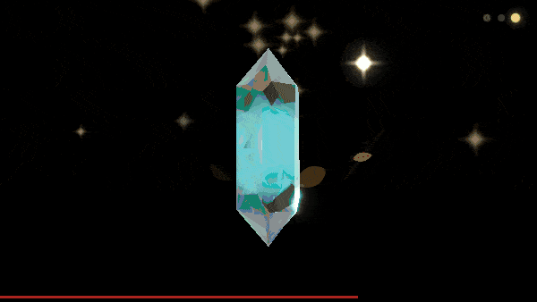

# Emotive Engine Examples

This directory contains working examples demonstrating how to use Emotive
Engine. All examples have been tested and vetted for junior developers and "vibe
coders."

## 🚀 Quick Start

### **[hello-world.html](hello-world.html)** ⭐ START HERE!

The simplest possible example. Perfect for learning the basic API.

**Features:**

- Minimal setup (just a few lines of code)
- 3 emotion buttons (calm, excited, sadness)
- Canvas with gradient background and backdrop glow
- Educational STEP-by-step comments

**Complexity:** ⭐ Beginner

**How to use:**

```bash
# 1. Build the project
npm run build:dev

# 2. Open in browser
open examples/hello-world.html
```

---

## 🔥 3D Elemental Gestures — Flagship Demo

<div align="center">



</div>

### **[elemental-gestures.html](3d/elemental-gestures.html)** ⭐⭐⭐ Advanced

The most visually rich example — 8 elemental systems with 130+ unique gestures,
GPU-instanced 3D effects, and custom GLSL shaders.

**Elements:** Fire, Water, Ice, Electricity, Earth, Nature, Light, Void

**Features demonstrated:**

- **GPU-instanced rendering** — dozens of 3D elements per gesture at 60fps
- **Custom GLSL materials** — per-element shaders (ice refraction, fire
  turbulence, electric Voronoi bolts)
- **Gesture choreography** — crowns, shields, pillars, vortexes, helixes,
  barrages, meditations
- **Post-processing pipeline** — bloom, ambient occlusion, distortion, velocity
  motion blur
- **mascotGlow system** — screen-space radiance halo on 53 gestures
- **Cutout + grain** — two-layer noise patterns for organic edge dissolve

**Complexity:** ⭐⭐⭐ Advanced

**Requires:** `npm run build` (full 3D build)

---

## 📚 Core Feature Examples

### **[basic-usage.html](basic-usage.html)** ⭐⭐ Intermediate

Comprehensive demo of all core features with best-practice layout.

**Features demonstrated:**

- **Emotions:** joy, calm, excited, sadness, love, focused, empathy, neutral
- **Shapes:** circle, heart, star, sun, moon
- **Gestures:** bounce, spin, pulse, glow, breathe, expand
- Two-column grid layout (emotions on left, shapes/gestures on right)
- Backdrop glow configuration
- Start/stop animation controls

**Complexity:** ⭐⭐ Intermediate

**Requires:** `npm run build:dev`

---

### **[breathing-app.html](breathing-app.html)** ⭐⭐ Intermediate

Complete breathing exercise app with timed animation sequences.

**Features demonstrated:**

- Timed animation sequences (inhale/hold/exhale/hold)
- Dynamic scale changes (expand/contract)
- Custom timing controls (4-7-8 breathing, box breathing, etc.)
- State management (start/stop/reset)
- UI feedback during breathing phases

**Complexity:** ⭐⭐ Intermediate

**Requires:** `npm run build:dev`

---

### **[event-handling.html](event-handling.html)** ⭐⭐ Intermediate

Shows how to listen to **REAL** mascot events.

**Features demonstrated:**

- Real event listeners using `mascot.on()`
- **gesture** events - When gestures are triggered
- **shapeMorphStarted** events - When shape morphing begins
- **resize** events - When canvas is resized
- **paused/resumed** events - When animation is paused/resumed
- Event-driven UI updates (live event log)

**Complexity:** ⭐⭐ Intermediate

**Requires:** `npm run build:dev`

---

### **[rhythm-sync-demo.html](rhythm-sync-demo.html)** ⭐⭐⭐ Advanced

Rhythm-based animations with tap tempo and beat synchronization.

**Features demonstrated:**

- Tap tempo detection with outlier filtering
- BPM-based gesture triggering
- Beat-synchronized animations
- Gesture highlighting with beat pulse
- Rolling window BPM calculation (last 8 taps)
- Active gesture visual feedback

**Complexity:** ⭐⭐⭐ Advanced

**Requires:** `npm run build:dev`

---

## 🎨 Asset Generators

These examples were used to create GIFs and demo assets for documentation.

### **[hero-banner-capture.html](hero-banner-capture.html)** ⭐⭐ Intermediate

Generates the hero banner animation for README.

**Features:**

- Banner-scale particle system (1280x400)
- No containment (particles move across full banner)
- Scaled up core and particles
- Auto-playing emotion sequence

**How to use:**

1. Open in browser
2. Use screen recording tool (ScreenToGif, etc.)
3. Record for ~8 seconds
4. Save as hero banner asset

**Requires:** `npm run build:dev`

---

### **[emotion-demo-capture.html](emotion-demo-capture.html)** ⭐⭐ Intermediate

Generates the Quick Start demo GIF showing emotion transitions.

**Features:**

- Auto-playing 8-second loop
- Emotion + shape + gesture choreography
- Optimized timing for smooth GIF capture
- 600x600px format

**How to use:**

1. Open in browser
2. Record 600x600px area for ~8 seconds
3. Save as Quick Start demo asset

**Requires:** `npm run build:dev`

---

## 🤖 AI Integration

### **[llm-integration/claude-haiku.html](llm-integration/claude-haiku.html)** ⭐⭐⭐ Advanced

Complete example integrating with Claude AI (Anthropic).

**Features demonstrated:**

- Two-panel chat interface (chat + mascot)
- Demo responses with sentiment analysis
- Real-time mascot reactions to conversation
- Sentiment → emotion → shape → gesture mapping
- Example prompts for quick testing
- Works in demo mode (no API key required for testing)

**Complexity:** ⭐⭐⭐ Advanced

**Requires:** `npm run build:dev`

**See also:** [llm-integration/README.md](llm-integration/README.md) for
complete LLM integration guide

---

## 🛠️ Framework Integration Templates

### **[react-component.jsx](react-component.jsx)** ⭐⭐⭐⭐ Advanced

⚠️ **TEMPLATE/GUIDE** - Shows how to integrate with React.

**What it shows:**

- React component lifecycle management
- UMD bundle loading options
- Real API method usage
- Event listener setup with React hooks
- Complete working demo component

**Note:** This is a template, not executable code. Study
[hello-world.html](hello-world.html) first!

**Complexity:** ⭐⭐⭐⭐ Advanced (Requires React + bundler knowledge)

---

### **[vue-component.vue](vue-component.vue)** ⭐⭐⭐⭐ Advanced

⚠️ **TEMPLATE/GUIDE** - Shows how to integrate with Vue.

**What it shows:**

- Vue component lifecycle (mounted/beforeUnmount)
- UMD bundle loading options
- Real API method usage
- Event emitting to parent components
- Complete working demo component

**Note:** This is a template, not executable code. Study
[hello-world.html](hello-world.html) first!

**Complexity:** ⭐⭐⭐⭐ Advanced (Requires Vue + bundler knowledge)

---

## 🏗️ Setup Instructions

### Build the Project

All examples (except templates) require building the project first:

```bash
# 1. Install dependencies
npm install

# 2. Build the project
npm run build:dev
# Creates: site/public/emotive-engine.js (UMD bundle)

# 3. Open any example in browser
open examples/hello-world.html
```

### Watch Mode (For Active Development)

```bash
# Terminal 1: Auto-rebuild on file changes
npm run build:watch

# Terminal 2: Serve files locally
npm run serve
# Opens: http://localhost:8000

# Then open: http://localhost:8000/examples/hello-world.html
```

---

## 📖 All Examples Summary

| Example                                                                    | Complexity        | Best For                |
| -------------------------------------------------------------------------- | ----------------- | ----------------------- |
| **[elemental-gestures.html](3d/elemental-gestures.html)**                  | ⭐⭐⭐ Advanced   | 3D elemental effects    |
| **[hello-world.html](hello-world.html)**                                   | ⭐ Beginner       | First-time learning     |
| **[basic-usage.html](basic-usage.html)**                                   | ⭐⭐ Intermediate | Learning all features   |
| **[breathing-app.html](breathing-app.html)**                               | ⭐⭐ Intermediate | Timed animations        |
| **[event-handling.html](event-handling.html)**                             | ⭐⭐ Intermediate | Event-driven apps       |
| **[rhythm-sync-demo.html](rhythm-sync-demo.html)**                         | ⭐⭐⭐ Advanced   | Rhythm-based animations |
| **[hero-banner-capture.html](hero-banner-capture.html)**                   | ⭐⭐ Intermediate | Creating banner assets  |
| **[emotion-demo-capture.html](emotion-demo-capture.html)**                 | ⭐⭐ Intermediate | Creating demo GIFs      |
| **[llm-integration/claude-haiku.html](llm-integration/claude-haiku.html)** | ⭐⭐⭐ Advanced   | AI integration          |
| **[react-component.jsx](react-component.jsx)**                             | ⭐⭐⭐⭐ Advanced | React integration guide |
| **[vue-component.vue](vue-component.vue)**                                 | ⭐⭐⭐⭐ Advanced | Vue integration guide   |

---

## 📋 API Quick Reference

### Real Emotions (from working examples)

`joy`, `calm`, `excited`, `sadness`, `love`, `focused`, `empathy`, `neutral`

### Real Shapes (from working examples)

`circle`, `heart`, `star`, `sun`, `moon`

### Real Gestures (from working examples)

`bounce`, `spin`, `pulse`, `glow`, `breathe`, `expand`

### Real Events (from working examples)

`gesture`, `shapeMorphStarted`, `resize`, `paused`, `resumed`,
`performanceDegradation`, `performanceRecovery`

### Core API Methods

```javascript
// Initialization (CRITICAL PATTERN)
const mascot = new EmotiveMascot({
    canvasId: 'mascot-canvas',
    targetFPS: 60,
    enableAudio: false,
    defaultEmotion: 'neutral',
    enableGazeTracking: false,
    enableIdleBehaviors: true,
});

await mascot.init(canvas); // MUST pass canvas element!

// Configuration
mascot.setBackdrop({
    enabled: true,
    radius: 3.5,
    intensity: 0.9,
    blendMode: 'normal',
    falloff: 'smooth',
    edgeSoftness: 0.95,
    coreTransparency: 0.25,
    responsive: true,
});

// Animation control
mascot.start();
mascot.stop();

// State changes
mascot.setEmotion(emotion); // Change emotion
mascot.morphTo(shape); // Morph to shape
mascot.express(gesture); // Trigger gesture
mascot.setScale({ core: 1.2 }); // Scale mascot

// Event listeners
mascot.on('gesture', data => {
    console.log('Gesture triggered:', data);
});
```

---

## 🐛 Troubleshooting

### "EmotiveMascot is not defined"

**Solution:** Run `npm run build:dev` first. The UMD bundle must be built before
examples work.

### "Failed to load: ../site/public/emotive-engine.js"

**Solution:** The build output doesn't exist. Run:

```bash
npm run build:dev
```

### Mascot initializes but doesn't render

**Solution:** You must pass the canvas element to `init()`:

```javascript
const canvas = document.getElementById('mascot-canvas');
await mascot.init(canvas); // ✅ Correct
```

### Changes don't appear

**Solution:** Rebuild after changing source files:

```bash
npm run build:dev
# Or use watch mode:
npm run build:watch
```

### Wrong emotions/shapes/gestures

**Solution:** Only use the real values from the API Quick Reference section
above. Many examples online use fake API methods that don't exist.

---

## 🎓 Learning Path

**New to Emotive Engine?** Follow this path:

1. **[hello-world.html](hello-world.html)** - Learn basic initialization
2. **[basic-usage.html](basic-usage.html)** - Explore all core features
3. **[event-handling.html](event-handling.html)** - Understand event system
4. **[breathing-app.html](breathing-app.html)** or
   **[rhythm-sync-demo.html](rhythm-sync-demo.html)** - Advanced timing
5. **[llm-integration/claude-haiku.html](llm-integration/claude-haiku.html)** -
   AI integration

**Want to use with React/Vue?**

- Study HTML examples first to understand the real API
- Then read the template files ([react-component.jsx](react-component.jsx),
  [vue-component.vue](vue-component.vue))
- Templates show how to wrap the mascot in framework lifecycle

---

## 🤝 Contributing Examples

Want to add your own example?

### Guidelines

1. **Copy [hello-world.html](hello-world.html) as starting point**
2. **Use only real API methods** (see API Quick Reference above)
3. **Add educational STEP comments** explaining WHY not just WHAT
4. **Use [example-styles.css](example-styles.css)** for consistent styling
5. **Include complexity rating** (⭐ to ⭐⭐⭐⭐)
6. **Test with:** `npm run build:dev`
7. **Add to this README** with clear description
8. **Submit a PR!**

### Good Example Topics

- Mobile-optimized layouts
- Game integrations
- Data visualization
- Accessibility features
- Performance optimization demos
- Custom particle effects

---

## 📝 Common Patterns

### Basic Initialization Pattern

```javascript
// STEP 1: Get canvas element
const canvas = document.getElementById('mascot-canvas');
canvas.width = 400;
canvas.height = 400;

// STEP 2: Create mascot instance
const mascot = new EmotiveMascot({
    canvasId: 'mascot-canvas',
    targetFPS: 60,
    enableAudio: false,
    defaultEmotion: 'neutral',
    enableGazeTracking: false,
    enableIdleBehaviors: false,
});

// STEP 3: Initialize with canvas element (CRITICAL!)
await mascot.init(canvas);

// STEP 4: Configure backdrop glow (optional)
mascot.setBackdrop({
    enabled: true,
    radius: 3.5,
    intensity: 0.9,
    blendMode: 'normal',
    falloff: 'smooth',
    edgeSoftness: 0.95,
    coreTransparency: 0.25,
    responsive: true,
});

// STEP 5: Start animation
mascot.start();
```

### Emotion + Gesture Pattern

```javascript
function setEmotion(emotion) {
    // Change emotion
    mascot.setEmotion(emotion);

    // Map emotions to complementary gestures
    const emotionGestures = {
        joy: 'bounce',
        calm: 'breathe',
        excited: 'spin',
        sadness: 'pulse',
        love: 'glow',
    };

    const gesture = emotionGestures[emotion];

    // Trigger gesture with slight delay
    if (gesture) {
        setTimeout(() => mascot.express(gesture), 300);
    }
}
```

### Shape Morphing Pattern

```javascript
function morphToShape(shape) {
    // Morph to new shape
    mascot.morphTo(shape);

    // Optional: Change emotion to match shape
    const shapeEmotions = {
        heart: 'love',
        star: 'joy',
        sun: 'excited',
        moon: 'calm',
        circle: 'neutral',
    };

    const emotion = shapeEmotions[shape];
    if (emotion) {
        setTimeout(() => mascot.setEmotion(emotion), 300);
    }
}
```

### Event Listener Pattern

```javascript
// Listen for gesture events
mascot.on('gesture', data => {
    console.log('Gesture:', data.name);
    // Update UI based on gesture
});

// Listen for shape morph events
mascot.on('shapeMorphStarted', data => {
    console.log('Morphing:', data.from, '→', data.to);
    // Show transition UI
});

// Listen for resize events
mascot.on('resize', data => {
    console.log('Canvas resized:', data.width, 'x', data.height);
    // Adjust layout
});
```

---

## 📚 Additional Resources

- **[Main README](../README.md)** - Project overview and features
- **[CONTRIBUTING.md](../CONTRIBUTING.md)** - Contribution guidelines
- **[ARCHITECTURE.md](../docs/ARCHITECTURE.md)** - Codebase architecture
- **[LLM Integration Guide](llm-integration/README.md)** - AI integration docs

---

## ⚠️ Important Notes

### What's Real vs. Fake

Many online examples use **fake API methods** that don't exist:

**❌ FAKE (don't use these):**

- `handleLLMResponse()`
- `configureLLMHandler()`
- `getLLMPromptTemplate()`
- `addGesture()` (use `express()` instead)
- `blendEmotions()`
- `queueGestures()`
- Emotions: `curiosity`, `excitement`, `concern`, `triumph`, `contemplation`

**✅ REAL (use these):**

- `setEmotion(emotion)`
- `morphTo(shape)`
- `express(gesture)`
- `setBackdrop(config)`
- `setScale(config)`
- `on(event, handler)`
- `start()` / `stop()`
- Emotions: `joy`, `calm`, `excited`, `sadness`, `love`, `focused`, `empathy`,
  `neutral`

**Always refer to working examples in this directory for real API usage!**

---

**Made with care by the Emotive Engine community**

**Start with [hello-world.html](hello-world.html) - it's the simplest working
example!**
